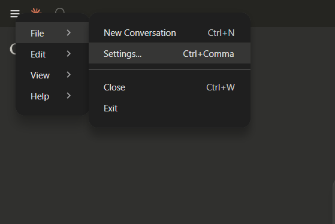
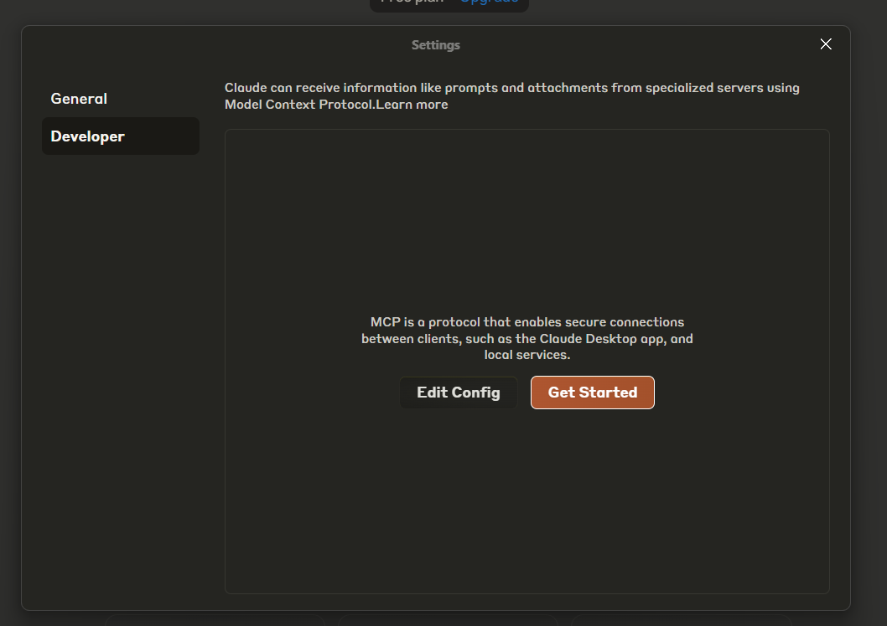
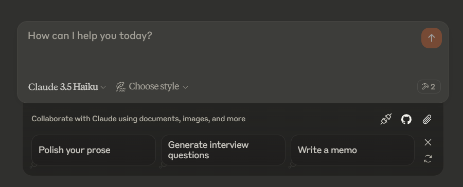
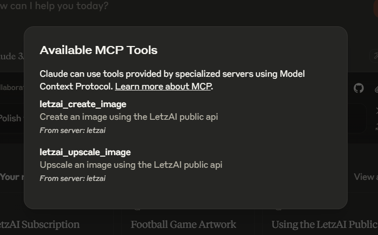

# Letz AI MCP Setup Guide

This guide will walk you through the process of setting up and using the Letz AI MCP (Model Context Protocol) for image generation.

## Prerequisites

Before you begin, ensure that you have the following:

- **Node.js** installed on your system. You can download it from [Node.js official site](https://nodejs.org/).
- **Claude Desktop App** installed. If you don't have it, download it from [Claude Desktop App](https://claude.app).
- **Letz AI API Key**. You can obtain it by visiting [Letz AI API](https://letz.ai/docs/api).

## Setup Steps

### 1. Download the Git Folder

Download the repository containing the Letz AI MCP project and place it in a location outside of your Downloads folder. For example:

```
C:\\Users\\username\\desktop
```

Alternatively, you can use `git clone` to clone the repository:

```bash
git clone <repository-url> C:\\Users\\username\\desktop
```

### 2. Install Dependencies

Navigate to the project folder using your terminal or command prompt:

```bash
cd C:\\Users\\username\\desktop
```

Run the following command to install all required dependencies:

```bash
npm install
```

### 3. Compile the Project

After installing the dependencies, compile the TypeScript files into JavaScript using the following command:

```bash
npx tsc
```

This will generate the compiled JavaScript files in the `build` folder.

### 4. Restart Claude App

After running `npx tsc`, you must **restart** the Claude Desktop App for it to recognize the updated MCP configuration and compiled files.

### 5. Set Up MCP Configuration in Claude Desktop App



1. **Open the Claude Desktop App**.
2. **Click on the Menu Icon** in the top-left corner.
3. From the dropdown, select **File**.
4. Navigate to **Settings**.
5. Under the **Developer** section, you will see an option for **Edit Config**.
   
6. Click on **Edit Config** — this will open the configuration folder.
7. Locate the file `claude_desktop_config.json` and edit it as needed.

#### Windows Configuration:

```json
{
  "mcpServers": {
    "letzai": {
      "command": "node",
      "args": [
        "C:\\ABSOLUTE\\PATH\\TO\\PARENT\\FOLDER\\letzai-mcp\\build\\index.js"
      ],
      "env": {
        "LETZAI_API_KEY": "<Your Letz AI API Key>"
      }
    }
  }
}
```

#### Ubuntu Configuration:

```json
{
  "mcpServers": {
    "letzai": {
      "command": "node",
      "args": ["/ABSOLUTE/PATH/TO/PARENT/FOLDER/letzai-mcp/build/index.js"],
      "env": {
        "LETZAI_API_KEY": "<Your Letz AI API Key>"
      }
    }
  }
}
```

#### macOS Configuration:

```json
{
  "mcpServers": {
    "letzai": {
      "command": "node",
      "args": ["/ABSOLUTE/PATH/TO/PARENT/FOLDER/letzai-mcp/build/index.js"],
      "env": {
        "LETZAI_API_KEY": "<Your Letz AI API Key>"
      }
    }
  }
}
```

### Configuration Explanation

- **command**: The command to run the application. We use `node` to run the JavaScript file generated by TypeScript.
- **args**: This is the path to the compiled `index.js` file. Make sure the path is correct according to where your files are located after compilation. If you've placed the folder at `C:\\Users\\username\\desktop\\letzai-mcp`, the path will be:

```

C:\\Users\\username\\desktop\\letzai-mcp\\build\\index.js

```

### 6. Run the MCP Server

Now that everything is set up, you can start using the Letz AI MCP in the Claude Desktop App. The server should be ready for image generation tasks once the app is running with the correct API key in the environment.

**Important:** After making changes to the configuration, you **must restart Claude** for the changes to take effect.

### 7. Testing the New MCP in Claude


Click on the hammer icon to view the installed MCP tools.


Once you've set up the MCP in the Claude Desktop App, you can test it by running the following prompt:

- **Create image with LetzAi using prompt: "A beautiful woman standing in a city at sunset. She has long flowing hair, wearing a chic, modern outfit, and is gazing out at the horizon with a serene expression. The cityscape behind her features tall buildings, with the warm hues of the sunset casting a golden glow over the scene. The sky is a blend of oranges, pinks, and purples, creating a peaceful yet vibrant atmosphere. Soft light reflects off the windows of the buildings, and a few people can be seen walking in the background, adding life to the urban setting."**

This will create the image based on the provided prompt and automatically upscale it after the image is generated. This ensures both image creation and upscaling functionalities are working correctly with the Letz AI MCP in Claude. Claude will open the image in your preferred browser.

## Troubleshooting

- **Node.js not found**: Ensure that Node.js is installed and added to your system's PATH environment variable.
- **Invalid API Key**: Double-check that you have correctly added your API key under the `LETZAI_API_KEY` variable in the Claude Desktop App settings.
- **File Path Issues**: Make sure that the path to the `index.js` file is correct. If you're unsure about the path, use the absolute path to the file.

For more detailed documentation and support, visit [Letz AI Docs](https://letz.ai/docs/api).
